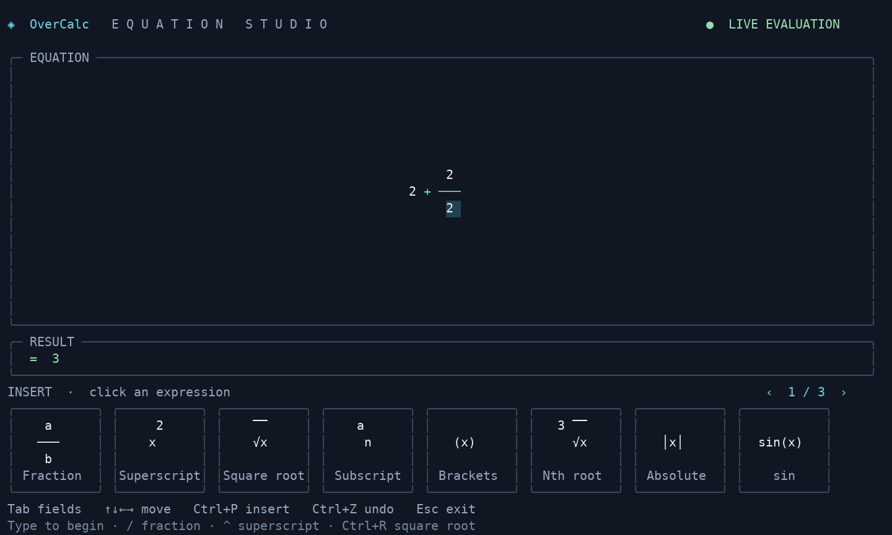

# OverCalc

OverCalc is a terminal equation editor and math engine. Build fractions, powers,
roots, and nested expressions directly on the screen without learning LaTeX.
It also provides exact arithmetic, symbolic simplification, differentiation,
JSON output, and batch evaluation through a reusable CLI.



The preview shows `2 + 2/2`, evaluated as 3. The bottom cards display the actual
structures they insert; the highlighted denominator is editable.

## Build and Install

Linux:

```sh
cmake -S . -B build -DCMAKE_BUILD_TYPE=Release
cmake --build build -j
ctest --test-dir build --output-on-failure
cmake --install build --prefix "$HOME/.local"
export PATH="$HOME/.local/bin:$PATH"
overcalc --tui
```

Without installing, run `./build/overcalc --tui`.

Windows with a C++23 compiler available in your shell:

```powershell
cmake -S . -B build
cmake --build build --config Release
ctest --test-dir build -C Release --output-on-failure
.\build\Release\overcalc.exe --tui
```

Single-configuration generators such as MinGW place the executable at
`.\build\overcalc.exe` instead. The examples below use the installed Linux command;
on Windows, substitute the path to `overcalc.exe`.

Requires CMake 3.20+, a C++23 compiler, and a Unicode-capable terminal. The visual
editor needs at least 40 columns × 18 rows; 80 × 24 or larger is more comfortable.

## Quick Start

Run a single expression:

```sh
overcalc "sin(pi/2)+50%"
```

Use LaTeX input:

```sh
overcalc "\frac{1}{3} + \frac{1}{6}"
overcalc "\sqrt[3]{8}"
overcalc "\left(2+3\right)^2"
```

Show steps:

```sh
overcalc --steps "sqrt(16)+x*0"
```

Differentiate:

```sh
overcalc --derive x "x^2 + sin(x)"
overcalc --json --steps --derive x "x^3"
```

Batch evaluate a file:

```text
# formulas.txt
2+2
sin(pi/2)+50%
x^2
```

```sh
overcalc --batch --file formulas.txt
overcalc --batch --derive x --file formulas.txt
```

## Interactive TUI Mode

Start the visual equation editor:

```sh
overcalc --tui
```

Type directly into the displayed equation. Fractions have editable numerator and
denominator fields; powers and subscripts appear above/below the base. Empty
fields show `□`. Structures can be nested without writing LaTeX.

The bottom insertion palette displays clickable miniature equations in bordered
cards, with page arrows for additional templates. It includes fractions, superscripts, subscripts, square
and indexed roots, brackets, absolute values, trig/log functions, constants,
multiplication, percent, and factorial. Click a button, or press **Ctrl+P**, use
arrows to choose, and press Enter. On small terminals, keyboard navigation reveals
additional pages. You can also click the page arrows.

- **Tab / Shift+Tab**: move between fields and out of a structure.
- **Left / Right**: move through values and enter nested structures.
- **Up / Down**: move between numerator/denominator or base/exponent.
- **Mouse click**: place the caret directly in the equation.
- **Home / End**: start/end of the current field.
- **Backspace / Delete**: remove a value or adjacent structure; at field edges,
  move across the boundary. **Ctrl+Z / Ctrl+Y** undo/redo edits.
- **Ctrl+F**: fraction; **Ctrl+E**: superscript; **Ctrl+R**: square root;
  **Ctrl+B**: subscript; **Ctrl+G**: brackets.
- Typing **/** or **^** wraps the preceding value as a fraction base/numerator
  or power base. Typing **(** inserts brackets; **)** leaves the field.
- **Ctrl+U**: clear; **Ctrl+D**: toggle derivative with respect to x.
- **Esc / Ctrl+C**: exit and restore the terminal. Esc closes an open palette first.

### Editing examples

Start `overcalc --tui`. Begin each example with **Ctrl+U** to clear the canvas.
“Tab” below means press the Tab key, not type the word.

| Build | Keys or actions | Live result |
| --- | --- | --- |
| Addition with a fraction | Type `2+2/2` | `3` |
| Fraction from empty fields | Click the stacked **a/b** card; type `1`, Tab, `4` | `1/4 ≈ 0.25` |
| Fraction plus a power | Type `12/4`, Tab, then `+2^3` | `11` |
| Root inside a fraction | Ctrl+F, Ctrl+R, type `9`, Tab, Tab, type `3` | `1` |
| Squared brackets | Type `(2+3)^2` | `25` |
| Greek constant | Find the **π** card using `‹` / `›`, click it, then type `/2` | `pi / 2 ≈ 1.570796327` |

For example, the fraction-plus-power expression is arranged spatially:

```text
12      3
── + 2
 4
```

To change a denominator, click its value directly or move down from the
numerator. **Home / End** move within that field. **Tab** leaves the denominator
so subsequent operators belong to the surrounding expression. Empty `□` fields
stay editable; results appear when the expression is complete.

The cards show stacked fractions, raised/lowered scripts, radical overbars,
brackets, and Greek symbols. **Ctrl+P** focuses the cards; arrow keys browse all
pages and **Enter** inserts the selected example as editable fields. Click either
the miniature formula or its caption to insert it with the mouse.

The canvas scrolls to keep the caret visible and the palette follows terminal
resizes. A terminal of at least 40 columns by 18 rows is required. The editor uses
Unicode fraction bars, radicals, tall parentheses, Greek letters, and spaced math
operators. Its centered equation panel highlights the active field; a separate
result panel displays exact and approximate values. The default dark background
keeps the interface readable in transparent terminals; `--no-color` disables the
color theme.

Piped `--tui` input retains the line-oriented preview and commands (`:derive x`,
`:derive off`, `:clear`, `:q`). Regular CLI input still accepts LaTeX.

After building, install the current binary so an older copy on PATH cannot hide
new flags:

```sh
cmake --install build --prefix "$HOME/.local"
# Ensure ~/.local/bin is on PATH before /usr/bin.
```

## CLI Options

```text
overcalc [options] '<expr>'
```

| Option | Description |
| --- | --- |
| `--ascii` | Use ASCII rendering |
| `--unicode` | Use Unicode rendering, the default |
| `--no-color` | Disable ANSI color |
| `--width N` | Set panel width |
| `--latex-output` | Print normalized LaTeX and result |
| `--json` | Print structured JSON |
| `--ast-json` | Print AST JSON |
| `--timing` | Print elapsed execution time |
| `--batch` | Evaluate one expression per input line |
| `--tui` | Start interactive editor/preview mode |
| `--derive VAR` | Differentiate with respect to `VAR` |
| `--diff VAR` | Alias for `--derive` |
| `--derivative VAR` | Alias for `--derive` |
| `--steps` | Show evaluation steps |
| `--file PATH` | Read expression input from a file |
| `--stdin`, `-` | Read expression input from stdin |
| `--list-symbols` | List supported LaTeX symbols |
| `--version` | Print version |
| `--help`, `-h` | Show help |

## Supported Input

Arithmetic:

```text
2 + 3 * 4
((2 + 3)^2 - 9) / 4
2pi
20% * 80
5!
```

LaTeX-style syntax:

```text
\frac{1}{2}
\sqrt{16}
\sqrt[3]{8}
\alpha_1 + \beta_2
\left|-3\right|
2\,\cdot\quad3
```

Functions and constants:

```text
sin(pi/2)
cos(\pi)
tan(x)
ln(e)
log(x)
exp(x)
abs(-3)
```

Differentiation currently supports constants, symbols, sums, differences, products,
quotients, numeric powers, `sin`, `cos`, `tan`, `ln`/`log`, `exp`, `sqrt`, and percent.

## JSON Output

```sh
overcalc --json --steps --derive x "x^2"
```

```json
{
  "line": 1,
  "input": "x^2",
  "ok": true,
  "latex": "x^{2}",
  "simplified": "2 * x",
  "simplified_latex": "2\\cdotx",
  "derivative": "2 * x",
  "derivative_latex": "2\\cdotx",
  "exact": "2 * x",
  "decimal": null,
  "steps": ["Start evaluation", "Derivative d/dx: 2 * x", "Symbolic exact form: 2 * x"]
}
```

## Roadmap

The active direction is:

- stronger simplification and symbolic forms
- richer derivative rules
- expression selection and saved editor sessions
- golden renderer tests
- graphing and REPL/session support

See `OVERCALC_MASTER_PLAN.md` for the long-form roadmap.
